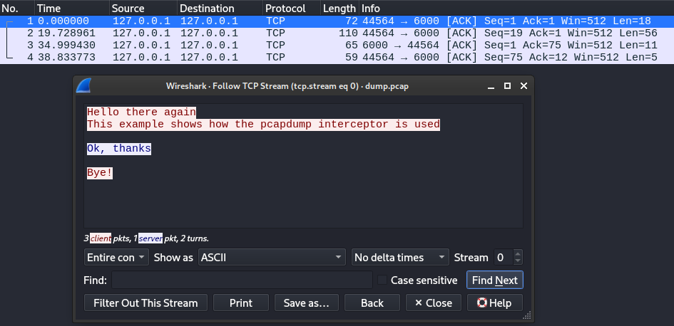

# tlstap

*tlstap* is a small TLS intercepting proxy.
It supports most commonly used TLS features (SNI, ALPN, mutual authentication).
It also supports detecting TLS hanshakes (Client Hello) automatically, therefore supporting the interception of opportunistic TLS communication transparetly (mostly, see [restrictions](#restrictions-to-client-hello-detection)).
*tlstap* can also function as a plain TCP forwarder.

All traffic passing through *tlstap* can be intercepted.
For this purpose, [interceptors](#interceptors) are available.
*tlstap* comes with a small selection of builtin interceptors that can be used without writing any code.
However, you can also use *tlstap* with custom interceptors, either [in Go](#custom-interceptors-in-go) or even in the [language of your choice](#custom-interceptors-in-other-languages).
Multiple interceptors can be active at the same time.

# Building
*tlstap* is written in Go and can therefore be used across multiple platforms.
You can build it for (and from) Linux or Windows like so (if you are building for the same platform you are currently running, you do not need to specify `GOOS`.):
```powershell
# for Windows
GOOS=windows go build -o tlstap.exe .
```
```shell
# for Linux
GOOS=linux go build -o tlstap .
```

# Usage
*tlstap* only takes two commandline arguments:
- `config` - path to the configuration file
- `enable` - comma-separated list of configurations to enable

## Configuration file
The global JSON configuration contains four sections see `ProxyConfig` in [config.go](./proxy/config.go)):
The `proxies`-section contains all the proxy definitions.
Any of the proxies defined here can then be enabled via the `-enable` command line option.
Each proxy definition makes use of one or more TLS server or client configuations and can use any of the defined `interceptors`.
The `tls-server-configs` and `tls-client-configs` define the available TLS server and client configurations.
Finally, all available interceptors are defined under `interceptors`.

```json
{
    "proxies": {
        "proxy-a": {
            "...": "..."
        },
        "proxy-b": {
            "...": "..."
        },
        "proxy-c": {
            "...": "..."
        }
    },
    "tls-server-configs": {
        "...": "..."
    },
    "tls-client-configs": {

    },
    "interceptors": {
        "...": "..."
    }
}
```

Then one or more configurations can be enabled like this (as long as they are not conflicting):
```
tlstap.exe -config config.json -enable proxy-a,proxy-c
```

An example configuration can be found in [config.json](config.json).


### Proxies
Each proxy configuration must define the mode, listen and connect (forward) endpoint as well as the TLS configurations to use.
The full configuration options are:
```json
"example-proxy": {
    "listen": "127.0.0.1:8443",
    "connect": "10.10.10.10:443",
    "mode": "plain|tls|detecttls|mux",
    "loglevel": "debug|info|warn|error",
    "logtime": false,
    "logfile": "/path/to/example-proxy.log",
    "server": "name-of-tls-server-config",
    "client": "name-of-tls-client-config",
    "interceptors": ["hexdump"],
    "mux": {
        "mux-handler-name": {
            "...": "..."
        }
    }
}
```
- `listen` - TCP endpoint where the server part of *tlstap* should listen
- `connect` - TCP endpoint where incoming traffic should be relayed to
- `mode` - mode of operation; available vaules:
    - `plain` - forward TCP traffic raw
    - `tls` - intercept TLS connections (TLS handshake immediately after TCP connection initiation)
    - `detecttls` - forward raw TCP traffic until TLS Client Hello is detected, then intercept TLS
    - `mux` - depending on the incoming server name (SNI), decide where to forward traffic and which server certificate to present
- `loglevel` - log level; available values: `debug`, `info` (default), `warn`, `error`; log levels below `info` should usually be avoided
- `logtime` - whether to include timestamps in the logging messages (default: `false`)
- `logfile` - path to file where the log output should be written; by default logs are written to stdout
- `server` - name of a TLS server configuration defined in the global `tls-server-configs` section
- `client` - name of a TLS client configuration defined in the global `tls-client-configs` section
- `interceptors` - array of names of interceptors defined in global `interceptors`
- `mux` - a multiplexer definition


### TLS server & client configuration
The TLS server and client configuration allow to specify most commonly used TLS options.
TLS server and client configuration have a similar structure (see `TlsServerConfig` and `TlsClientConfig` [config.go](./proxy/config.go)).
Server and client configuration are placed in the global `tls-server-config` and `tls-client-config` sections respectively.


#### Server config
TLS server configurations offers the following options:
```json
"example-server": {
    "cert-pem": "/path/to/server.pem",
    "cert-key": "/path/to/server.key",
    "client-roots": "path/to/client-ca1.pem,path/to/client-ca2.pem",
    "client-auth": "none|request|require-any|verify-if-given|require-and-verify",
    "alpn": ["h2", "http/1.1"],
    "min-version": "1.0|1.1|1.2|1.3",
    "max-version": "1.0|1.1|1.2|1.3",
    "keylog": "path/to/key.log",
    "truncate-keylog": false
}
```
- `cert-pem` - path to certificate in PEM format
- `cert-key` - path to certificate key
- `client-roots` - comma-separated list of paths to client trust roots (used to verify client certificates)
- `client-auth` - client authentication policy; available values (also see [ClientAuthType](https://pkg.go.dev/crypto/tls#ClientAuthType)):
    - `none` - do not request client certificate
    - `request` - request client certificate; client is not required to send one
    - `require-any` - requires the client to send a certificate; the certificate is not validated
    - `verify-if-given` - request a client certificate; client is not required to send one, but if sent, the certificate is validated
    - `require-and-verify` - require the client to send a certificate; the certificate is validated against the `client-roots`
- `min-version` - minimum acceptable TLS version; available values: `1.0` (default),`1.1`, `1.2`, `1.3`
- `max-version` - maximum acceptable TLS version; available values: `1.0`,`1.1`, `1.2`, `1.3` (default)
- `alpn` - which next protocol (ALPN) values to accept (the first one in this list that is also offered by the client will be accepted)
- `keylog` - path to TLS keylog file; if not specified, no TLS key logs are written
- `truncate-keylog` - whether the keylog file should be truncated on startup; default: `false`


#### Client config
TLS client configurations offers the following options:
```json
"example-client": {
    "cert-pem": "/path/to/client.pem",
    "cert-key": "/path/to/client.key",
    "roots": "path/to/ca1.pem,path/to/ca2.pem",
    "skip-verify": false,
    "min-version": "1.0|1.1|1.2|1.3",
    "max-version": "1.0|1.1|1.2|1.3",
    "server-name": "target-server.local",
    "sni-passthroug": false,
    "alpn": ["h2"],
    "alpn-passthrough": false,
    "ciphersuites-override": ["TLS_AES_128_GCM_SHA256", "TLS_ECDHE_RSA_WITH_AES_128_GCM_SHA256"],
    "keylog": "path/to/key.log",
    "truncate-keylog": false
}
```
Most options are analogous to the corresponding TLS server configuration options.
These differ:
- `roots` - comma-separated list of paths to CA certificates
- `skip-verify` - whether server certificate validation should be skipped (default: `false`)
- `server-name` - name of the target server (SNI) to send; overrides SNI passthrough
- `sni-passthrough` - whether the server name picked up from the downstream client should be used to connect to the upstream server (default: `false`)
- `alpn` - list of next protocols (ALPN) to send; overrides ALPN passthrough
- `alpn-passthrough` - whether the application protocol negotiated between the downstream and the proxy server should be forwarded to the upstream server (default: `false`)
- `ciphersuites-override` - list of names of ciphersuites to offer the upstream server (see [Go TLS cipher suites](https://pkg.go.dev/crypto/tls#CipherSuites))


### Interceptor configuration
The interceptor configuration allows specifying the active interceptors and has the following structure (see [InterceptorConfig](./proxy/config.go)):
```json
"my-interceptor": {
    "name": "my-interceptor",
    "disable": false,
    "direction": "up|down|any",
    "args": {
        "...": "..."
    },
    "args-json": "{ ... }"
}
```
- `name` - name of the interceptor; standard interceptors: `hexdump`, `pcapdump`
- `disable` - optionally disable the interceptor; default: `false`
- `direction` - direction in which the interceptor should be active; default `both`; available values:
    - `up` - only process traffic headed upstream (client -> server)
    - `down` - only process traffic headed downstream (server -> client)
    - `any` - process traffic in any direction
- `args` - interceptor arguments as `map[string]any` structure
- `args-json` - `args` but serialized to a single JSON string; *should not be set directly*; useful in conjunction with  [json.Unmarshal](https://pkg.go.dev/encoding/json#Unmarshal)


# Interceptors
*tlstap* comes with a few interceptors that may be useful in various scenarios.

## hexdump interceptor (`hexdump`)
The hexdump interceptor creates a simple hexdump of all data passing through it.
The following shows an example of the usage of the hexdump interceptor with the following configuration:
```json
{
    "example-hexdump-plaing": {
        "listen": "127.0.0.1:5000",
        "connect": "127.0.0.1:6000",
        "mode": "plain",
        "interceptors": [
            {
                "name": "hexdump"
            }
        ]
    }
}
```
Output:
```
go run tlstap.go -config config.json -enable example-hexdump-plain                                      
INFO: proxy (mode plain) listening at 127.0.0.1:5000 and forwarding to 127.0.0.1:6000
INFO: Forwarding 127.0.0.1:38250 <-> 127.0.0.1:6000
INFO: Connection established: 0 (127.0.0.1:38250->127.0.0.1:6000)
INFO: Connection established: 0 (127.0.0.1:6000->127.0.0.1:38250)
INFO: 127.0.0.1:38250 -> 127.0.0.1:6000 (0):
00000000  48 65 6c 6c 6f 20 74 68  65 72 65 21 0a           |Hello there!.|

INFO: 127.0.0.1:38250 -> 127.0.0.1:6000 (0):
00000000  54 68 69 73 20 69 73 20  6a 75 73 74 20 61 20 73  |This is just a s|
00000010  69 6d 70 6c 65 20 64 65  6d 6f 20 6f 66 20 74 68  |imple demo of th|
00000020  65 20 68 65 78 64 75 6d  70 20 69 6e 74 65 72 63  |e hexdump interc|
00000030  65 70 74 6f 72 2e 0a                              |eptor..|

INFO: 127.0.0.1:6000 -> 127.0.0.1:38250 (0):
00000000  4f 6b 2c 20 74 68 61 6e  6b 73 21 0a              |Ok, thanks!.|

INFO: Terminating connection 0 (127.0.0.1:38250 <-> 127.0.0.1:6000). Reason: EOF
INFO: Connection terminated: 0 (127.0.0.1:38250->127.0.0.1:6000)
INFO: Connection terminated: 0 (127.0.0.1:6000->127.0.0.1:38250)
```

## pcapdump intercepotor (`pcapdump`)
The pcapdump interceptor writes all data passing through it to a pcap file.
This may be useful e.g. in conjunction with with [Wireshark](https://www.wireshark.org).


## Custom interceptors in Go
You can implement custom interceptors directly in Go accoriding to the [Interceptor](./proxy/interceptor.go) interface.
The function `StartWithCli` (see [cli.go](./cli/cli.go)) facilitates the use of custom interceptors in conjunction with the command line interface provided by *tlstap*.
For this purpose, `StartWithCli` takes a callback function of type `InterceptorCallback` (see [cli.go](./cli/cli.go)).
All interceptor names not recognized by *tlstap* are passed to the given callback together with the interceptor arguments from the configuration.
The callack is responsible for instanciating a suitable interceptor.

Examples of how to use custom interceptors in Go together with the command line interface is shown in the [rot-interceptor](./examples/rot-interceptor/main.go) and [string-replacer](./examples/string-replacer/main.go) examples. 

## Custom interceptors in other languages (bridge interceptor)
*tlstap* also supports implementing custom interceptors in other programming languages.
For this purpose, on the Go side, the [bridge](./intercept/bridge.go) interceptor exists.
The custom interceptor is expected to listen on a given TCP endpoint.
For each connection handled by the bridge interceptor, a new TCP connection to the custom interceptor is initiated.
All traffic passing through the bridge interceptor is then forwarded to the custom interceptor.
At this point, data can be manipulated arbitrarily.
For each message sent to the custom interceptor, it is expected to reply with exactly one message frame.

The message framing format for communication between the bridge and the custom interceptor can be found in [bridge](./intercept/bridge.go).
The two frame types `InfoFrame` and `DataFrame` exist.
Note that all strings are UTF8 encoded and prefixed by their length (uint32).
Integer values are encoded in little endian.

### Info frames
`InfoFrame`s have the following layout:
```
// InfoFrame
type                - byte
event ID            - byte
connection ID       - uint32
downstream remote   - string
upstream remote	    - string
```
For example, an `InfoFrame` with event ID `0x20` (`BridgeEventInfo`), connection ID `17`, downstream remote `127.0.0.1:5000` and upstream remote `127.0.0.1:6000` serializes to the following byte stream:
```
0120110000000e0000003132372e302e302e313a353030300e0000003132372e302e302e313a36303030

// parts
01                                      // frame type info
20                                      // event ID 32
11000000                                // connection ID 17
0e000000 3132372e302e302e313a35303030   // downstream remote "127.0.0.1:5000"
0e000000 3132372e302e302e313a36303030   // upstream remote "127.0.0.1:6000"
``` 

### Data frames
`DataFrame`s have the following layout:
```
// DataFrame
type            - byte
data size       - uint32
connection ID   - uint32
data            - byte[size]
```

For example, a `DataFrame` with connection ID `17` and data `hello proxy` (11 bytes) serializes to the following byte stream:
```
000b0000001100000068656c6c6f2070726f7879

// parts
00                          // frame type data
0b000000                    // size (11 bytes)
11000000                    // connection ID 17
68656c6c6f2070726f7879      // data ("hello proxy")
```

### Python framework
For Python, this message framing is implemented in [pyintercept](./pyintercept).
With this small framework, only the class [Interceptor](./pyintercept/interceptor.py) needs to be implemented.
An example of a custom interceptor written in Python can be found in [string-replacer-py](./examples/string-replacer-py/main.py).


# Details
Understanding of some inner workings of *tlstap* may be useful in some scenarios.
Therefore, some details are documented here.

## Client Hello detection
TLS Client Hello works by scanning all data for structures that resemble a TLS Client Hello.
Of course, without knowledge of the application protocol, this is necessarily an heuristic approach.
It is easily possible to construct an application protocol that will trick *tlstap* into detecting TLS Client Hello messages even if no TLS is in use.
However, limited testing has not yet produced any organic false positives. 

## Restrictions to Client Hello detection
*tsltap* is agnostic to the applicatio protocol (e.g. HTTP, SMTP, custom protocols).
Therefore, *tlstap* is also not aware of the application protocol specific message framing.
All data is processed as it is received.
Therefore, it is possible that TLS Client Hello messages are fragmented.
In this case, *tlstap* cannot necessarily detect the Client Hello message.

If the TLS Client Hello is fragmented in a way that it arrives in multiple chunks, *tlstap* is likely to not detect it as such.
Therefore, the following fragmented Client Hello might slip by *tlstap*.

```
-----------------------   -----------------------
| Client Hello part 1 |   | Client Hello part 2 |
-----------------------   -----------------------
```

However, if there is other data preceding the TLS Client Hello, this should not be a problem.
Therefore, if the following data is received in one chunk, the TLS Client Hello should still be detected:
```
----------------------------
| some data | Client Hello |
----------------------------
```
This should be handled as if the following two chunks were received separately:
```
-------------   ----------------
| some data |   | Client Hello |
-------------   ----------------
```

Note that this restriction is quite fundamental since there is no reliable way to detect a partial TLS Client Hello.
It is possible to detect the Client Hello after enough of it has been received, but by then part of it may already have been sent on to the destination.
At this point interception is, while in theory still possible with a custom TLS implementation, no longer practical.


# TODO
- test SNI and SNI passthrough (with and without mux mode)
- test mux mode with different TLS server & client configs for different targets
- test per-handler interceptors in mux mode
- test per-handler log files & levels